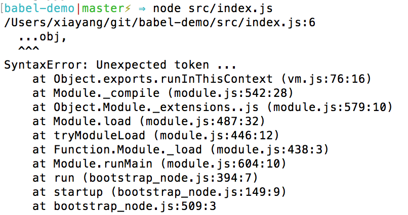

# Babel 学习笔记

## 概述
Babel是一个js编译工具，我们可以把babel的作用理解为js=》js，Babel存在的大部分原因是由于ECMAScript标准近几年更新特别快，但是浏览器厂商或者node环境对标准的支持跟不上标准更新的速度，为了让广大Jser能够赶紧使用上新的标准甚至可以尝试新的标准提案，Babel提供一种解决方案，可以将用户用新标准书写的语法转换成被广大浏览器所接受的ES5语法。另外，babel的存在也使得像JSX这种特殊的js语法可以得以使用。
## 概念介绍
### babel-cli
babel-cli是babel提供的一个命令行工具，可以将帮助用户进行js文件的编译。
通过运行 babel ./src/cli.js -o lib/cli.js 我们将
```javascript
const func = (item) => item + 1;
console.log(func(1));
```
转换成：
```javascript
"use strict";

var func = function func(item) {
  return item + 1;
};
console.log(func(1));

```
### babel-register
babel-register提供另外一种babel编译方式，不需要进行手动编译，只要引入就可以直接运行。
例如如下代码 直接用node src/index.js运行将会报错：
```javascript
const obj = {
  name: 'orangeyyy'
};

const obj2 = {
  ...obj,
  age: 18
};

console.log(`${obj2.name}:${obj2.age}`);
```

但是如果新增一个register.js文件，然后运行 node src/register.js 则会得到正确结果。
```javascript
require('babel-register');
require('./index.js');
```
> babel-regiser比较适合运用于构建脚本或其他本地运行脚本，但是对于生产环境，最好还是先编译再使用。

> 上例中不要将babel-register直接放到index.js文件中，而是应该新增一个register文件，然后在register文件中引用index.js,这是由于在进行文件编译之前必须要先注册babel，如果都放在同一个文件中，node会在babel编译之前就直接执行index文件。
### babel-core
babel-core提供一种通过编程方式使用babel的方式。
引入babel-core：
```javascript
const babel = require('babel-core');
```
babel-core可以直接用来编译字符串形式的代码：
```javascript
babel.transform("code();", options);
// => { code, map, ast }
```
对于文件夹，babel-core提供同步或者异步两种形式：
```javascript
babel.transformFileSync("filename.js", options);
// => { code, map, ast }

babel.transformFile("filename.js", options, function(err, result) {
  result; // => { code, map, ast }
});
```
如果已经有babel AST（抽象语法树，关于抽象语法树可以再开一篇文章） 可以直接用来编译：
```javascript
babel.transformFromAst(ast, code, options);
// => { code, map, ast }
```
### babel-runtime
### babel-polyfill
### babel-eslint
### .babelrc

## 使用指南

## 实战