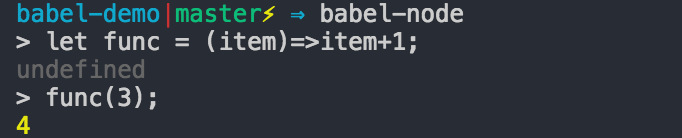
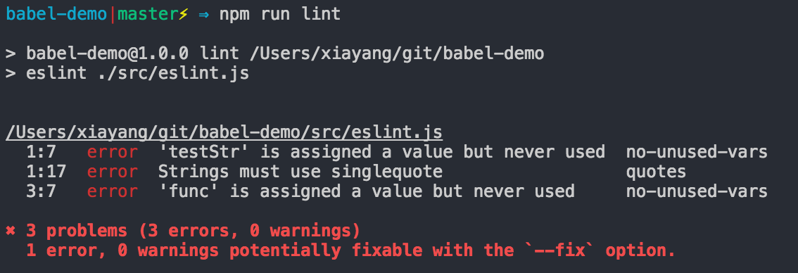
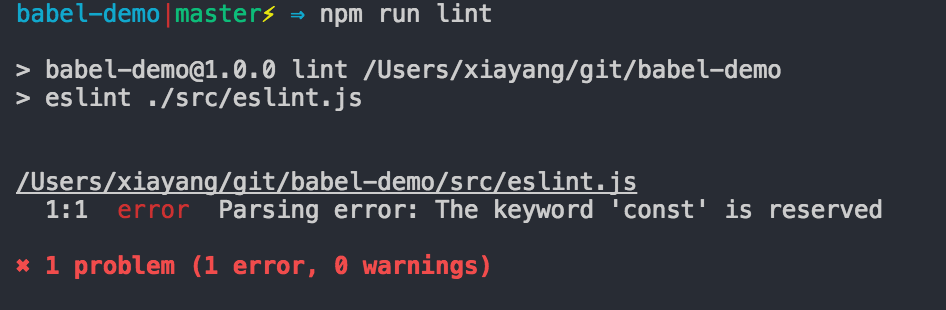

# Babel 学习笔记

## 概述
Babel是一个js编译工具，我们可以把babel的作用理解为js=》js，Babel存在的大部分原因是由于ECMAScript标准近几年更新特别快，但是浏览器厂商或者node环境对标准的支持跟不上标准更新的速度，为了让广大Jser能够赶紧使用上新的标准甚至可以尝试新的标准提案，Babel提供一种解决方案，可以将用户用新标准书写的语法转换成被广大浏览器所接受的ES5语法。另外，babel的存在也使得像JSX这种特殊的js语法可以得以使用。
## 概念介绍
### babel-cli
babel-cli是babel提供的一个命令行工具，可以将帮助用户进行js文件的编译。
通过运行 babel ./src/cli.js -o lib/cli.js 我们将
```javascript
const func = (item) => item + 1;
console.log(func(1));
```
转换成：
```javascript
"use strict";

var func = function func(item) {
  return item + 1;
};
console.log(func(1));
```
### babel-node
babel-node是babel-cli自带的一个工具，提供一个支持ES6的REPL环境，它支持Node中REPL的所有功能，同时可以支持直接运行node代码。
直接执行js文件：


直接执行代码：


### babel-register
babel-register提供另外一种babel编译方式，不需要进行手动编译，只要引入就可以直接运行。
例如如下代码 直接用node src/index.js运行将会报错：
```javascript
const obj = {
  name: 'orangeyyy'
};

const obj2 = {
  ...obj,
  age: 18
};

console.log(`${obj2.name}:${obj2.age}`);
```

但是如果新增一个register.js文件，然后运行 node src/register.js 则会得到正确结果。
```javascript
require('babel-register');
require('./index.js');
```
> babel-regiser比较适合运用于构建脚本或其他本地运行脚本，但是对于生产环境，最好还是先编译再使用。

> 上例中不要将babel-register直接放到index.js文件中，而是应该新增一个register文件，然后在register文件中引用index.js,这是由于在进行文件编译之前必须要先注册babel，如果都放在同一个文件中，node会在babel编译之前就直接执行index文件。

### babel-core
babel-core提供一种通过编程方式使用babel的方式，但是babel-core只是负责代码解析及AST生成，并没有转码，转码由插件来完成。
引入babel-core：
```javascript
const babel = require('babel-core');
```
babel-core可以直接用来编译字符串形式的代码：
```javascript
babel.transform("code();", options);
// => { code, map, ast }
```
对于文件夹，babel-core提供同步或者异步两种形式：

```javascript
babel.transformFileSync("filename.js", options);
// => { code, map, ast }

babel.transformFile("filename.js", options, function(err, result) {
  result; // => { code, map, ast }
});
```
如果已经有babel AST（抽象语法树，关于抽象语法树可以再开一篇文章） 可以直接用来编译：
```javascript
babel.transformFromAst(ast, code, options);
// => { code, map, ast }
```
### babel-runtime
为了实现EcmaScript的一些细节，babel会有一些helper方法保证代码的整洁，通常情况下在进行编译的时候会将这些方法打到编译后的文件最上方，使用babel-runtime，可以将这些helper方法统一移到runtime中，在进行编译的时候会将babel-runtime引入编译文件，而不是直接把helper方法打到文件上。
对于以下代码：
```javascript
class Obj {
  constructor(name) {
    this.name = name;
  }
  getName() {
    return this.name;
  }
}
```
未使用babel-runtime时,编译结果为：
```javascript
"use strict";

var _createClass = function () { function defineProperties(target, props) { for (var i = 0; i < props.length; i++) { var descriptor = props[i]; descriptor.enumerable = descriptor.enumerable || false; descriptor.configurable = true; if ("value" in descriptor) descriptor.writable = true; Object.defineProperty(target, descriptor.key, descriptor); } } return function (Constructor, protoProps, staticProps) { if (protoProps) defineProperties(Constructor.prototype, protoProps); if (staticProps) defineProperties(Constructor, staticProps); return Constructor; }; }();

function _classCallCheck(instance, Constructor) { if (!(instance instanceof Constructor)) { throw new TypeError("Cannot call a class as a function"); } }

var Obj = function () {
  function Obj(name) {
    _classCallCheck(this, Obj);

    this.name = name;
  }

  _createClass(Obj, [{
    key: "getName",
    value: function getName() {
      return this.name;
    }
  }]);

  return Obj;
}();

```
如果在.babelrc中按如下方式配置babel-runtime:
```json
{
  "presets": ["es2015", "stage-0"],
  "plugins": ["transform-runtime"]
}
```
得到的结果为:
```javascript
"use strict";

var _classCallCheck2 = require("babel-runtime/helpers/classCallCheck");

var _classCallCheck3 = _interopRequireDefault(_classCallCheck2);

var _createClass2 = require("babel-runtime/helpers/createClass");

var _createClass3 = _interopRequireDefault(_createClass2);

function _interopRequireDefault(obj) { return obj && obj.__esModule ? obj : { default: obj }; }

var Obj = function () {
  function Obj(name) {
    (0, _classCallCheck3.default)(this, Obj);

    this.name = name;
  }

  (0, _createClass3.default)(Obj, [{
    key: "getName",
    value: function getName() {
      return this.name;
    }
  }]);
  return Obj;
}();
```

> babel-runtime 要用--save安装而不是--save-dev。

### babel-polyfill
babel会编译几乎所有新的EcmaScript语法，对于新的API接口则不会，例如，Array.from、Object.asign、String.startsWith等等。如果想要在代码中使用新的API就要使用到babel-polyfill了。使用babel-polyfill的方法是安装babel-polyfill并在代码的最上层引入babel-polyfill。

### babel-eslint
eslint主要用于代码语法和风格的检查，对于这类工具我们需要先对代码进行前置转码在进行检查，这样就需要用到babel-eslint。babel-eslint的主要是用是在.eslintrc中的parser中配置eslint-babel。

```json
{
  "parser": "babel-eslint",
  "rules": {
    "quotes": [2, "single"],
    "no-undef": [2],
    "no-unused-vars": [2, { "vars": "local" }]
  }
}
```
对于以下代码，如果运行eslint src/eslint.js,

```javascript
const testStr = "hello world";
const func = (str) => str + '!';
```
会得到如下结果，很明显eslint不认识const，


但是如果将.eslintrc中的parser去掉，将得到以下结果：


> babel-eslint主要是针对一些eslint还不支持的类型及实验性的特征，对于这些eslint还不支持的特性，babel-eslint会将他们转换成eslint认识的语法，否则推荐是用eslint默认的parser。

### .babelrc
babel本身是不会做任何事情的，需要通过preset和plugin告诉babel该如何编译代码，而配置preset和plugin最好的方式就是通过.babelrc。一般.babelrc的配置如下所示：
```json
{
  "presets": ["es2015", "stage-0"],
  "plugins": ["transform-runtime"]
}
```
其实preset就是一个preset加plugin的集合，更简单的理解就是preset其实就是一份.babelrc配置，可以参考[babel-preset-orangeyyy](https://github.com/orangeyyy/babel-preset-orangeyyy),这是我自己写的一个preset例子。在.babelrc中编译器的执行顺序为：
* plugin优先于preset；
* plugin中按照数组顺序执行；
* preset中按照数组倒序执行；

## 总结
babel的整体信息流程为:代码解析=》AST生成=》转码=》代码生成。其中转码过程由一系列的插件完成。在这个生产环境落后于规范制定的时代，babel给广大开发者提供了可以使用最新规范的机会，也帮助大家提升了开发效率。

## 参考文档
* [Babel官方文档](http://babeljs.io/)
* [Babel 用户手册](https://github.com/thejameskyle/babel-handbook/blob/master/translations/zh-Hans/user-handbook.md#toc-babel-runtime)
* [Babel 入门教程](http://www.ruanyifeng.com/blog/2016/01/babel.html)


PS：文章中的所有例子可以查看[babel-demo](https://github.com/orangeyyy/babel-demo)。