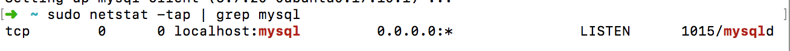
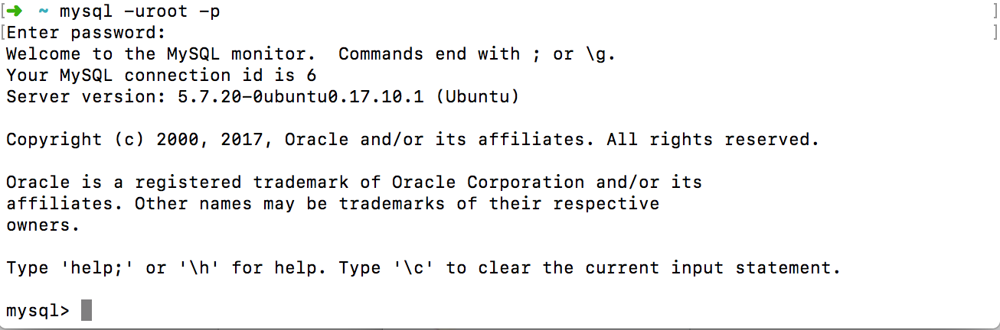
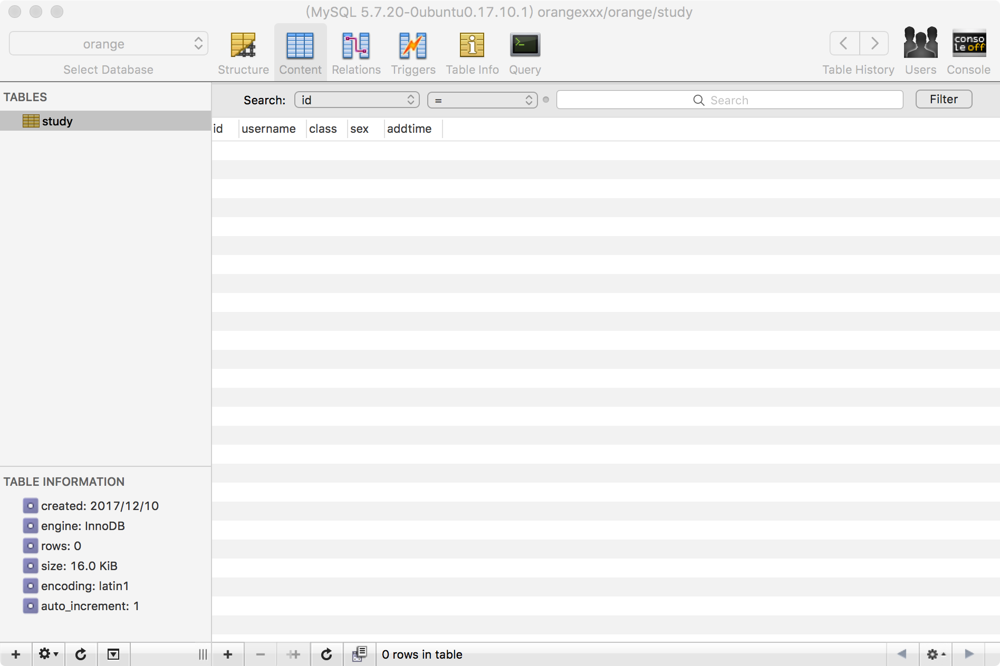

# 搭建MySQL服务

## 概述


* 系统版本：Ubuntu 17.10
* MySQL版本：

## 安装MySQL
安装MySQL服务端及客户端：
```sh
apt-get install mysql-server
apt-get install mysql-client
```
安装mysql-server会提示设置一个root角色的密码。
通过运行下面的命令判断mysql是否安装成功。
```sh
sudo netstat -tap | grep mysql
```

## 使用MySQL
### 进入MySQL服务
通过运行下面的命令，会提示输入刚刚安装时候的密码，成功登陆后进入MySQL的操作界面。
```
mysql -uroot -p
```


### 基本命令
#### 数据库操作
* 查看所有数据库 ```show databases;```
* 新建数据库 ```create database xxx```
* 删除数据库 ```drop database xxx```
* 使用数据库 ```use xxx```
#### 数据表操作
* 查看数据表 ```show tables```
* 新建表 ```create table xxx(attributes...)```
* 删除表 ```drop table xxx```

其他的操作就不一一介绍了，基本都是sql语法。
> PS:mysql所有命令必须用；结尾

## 远程连接
命令行工具来操作数据库还是比较痛苦的，尤其是创建数据表，所以我们需要通过远程的客户端来连接数据库服务进行可视化的数据库操作。

在Ubuntu下MySQL缺省是只允许本地访问的，如果你要其他机器也能够访问的话，那么需要改变/etc/mysql/my.cnf配置文件了。
```sh
vim /etc/mysql/mysql.conf.d/mysqld.cnf
```
然后注释掉其中的 **bind-address 127.0.0.1**。
保存退出后进入mysql服务执行下面命令进行授权。
```sql
grant all on *.* to root@'%' identified by '你的密码' with grant option;

flush privileges;
```
退出mysql服务并重启mysql服务：
```
service mysql restart
```
现在就可以在远程通过可视化工具连接数据库了。这里我使用MAC系统的Sequel Pro客户端来对数据库进行各种操作，具体工具使用就不在这里介绍了。


## 参考
* https://jingyan.baidu.com/article/5bbb5a1b2b110213eba179d2.html
* https://jingyan.baidu.com/article/425e69e6bbc6c7be14fc1640.html
* http://wiki.ubuntu.org.cn/MySQL%E5%AE%89%E8%A3%85%E6%8C%87%E5%8D%97
* http://www.linuxidc.com/Linux/2017-06/144805.htm
