# 科学上网

墙内的世界很无赖，墙外的世界真精彩，作为一个IT从业者，如果一直在墙内待着，眼界会非常闭塞，更重要的是，如果要查个什么资料，只能去狼爪，好不容易查到个不错的网站，发现还打不开，别提多郁闷了，所以掌握科学上网技巧必不可少。

## VPS
如果要科学上网，需要一个中继器将墙外的内容转到墙内来，通常的做法是在国外的VPS上搭一个代理服务，那么，首先我们得有一个国外的VPS。
### 常用的国外VPS服务商
* [Vultr](http://www.laozuo.org/go/vultr.com)
* [SugarHosts](http://www.sugarhosts.com/)
* [Linode](http://www.linode.com/)
* [BandwagonHost（搬瓦工VPS）](https://bwh1.net/index.php)
* [RAKSmart](http://www.raksmart.com/)
* [DigitalOcean](http://www.DigitalOcean.com/)

### Vultr
Vultr是大家比较推荐的VPS服务商，一个VPS实例基本$5每个月（也有$2.5每月的，但是经常卖光了），可以按小时计费，可以随时新建或删除实例，速度还不错，另外还支持支付宝，这里就以Vultr为例演示一下如何使用VPS。
* 进入Vultr并创建账号

和大部分网站创建用户一样，填写email及密码，然后通过邮件验证就可以正常使用了
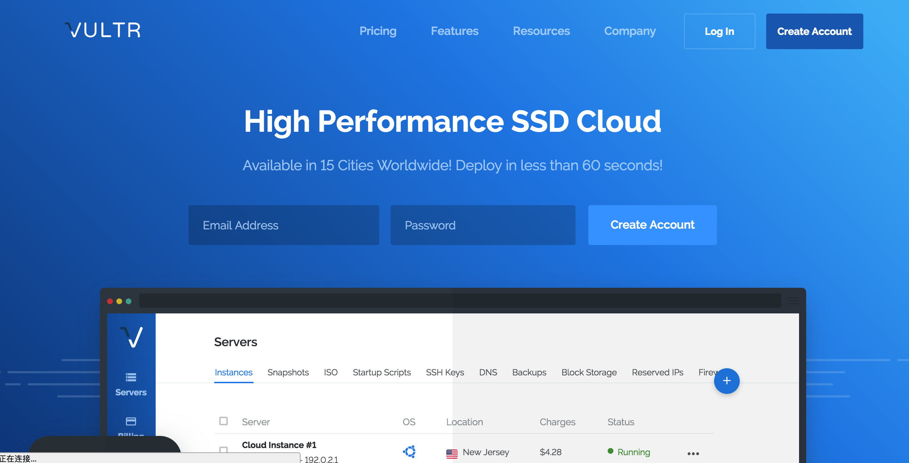

* 账号充值

在用户工作台中进入Billing菜单，然后在选择Alipay用支付宝进行充值，最低需要充值$10，相当人民币60+吧，Vultr的服务是按小时收费，如图可以看出，我的一个$5每月的实例一天大概扣了$0.2，感觉还是挺经用的。
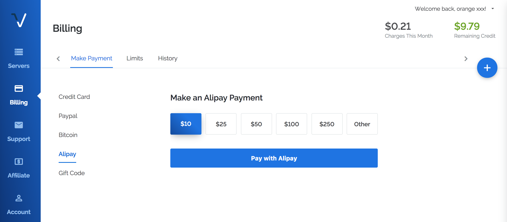

* 创建实例

其实首页的视频已经介绍的很详细了，基本是傻瓜式的，选选机房，选选配置，选选套餐然后提交就开始进行实例构建了。

这里我选的是洛杉矶的实例：
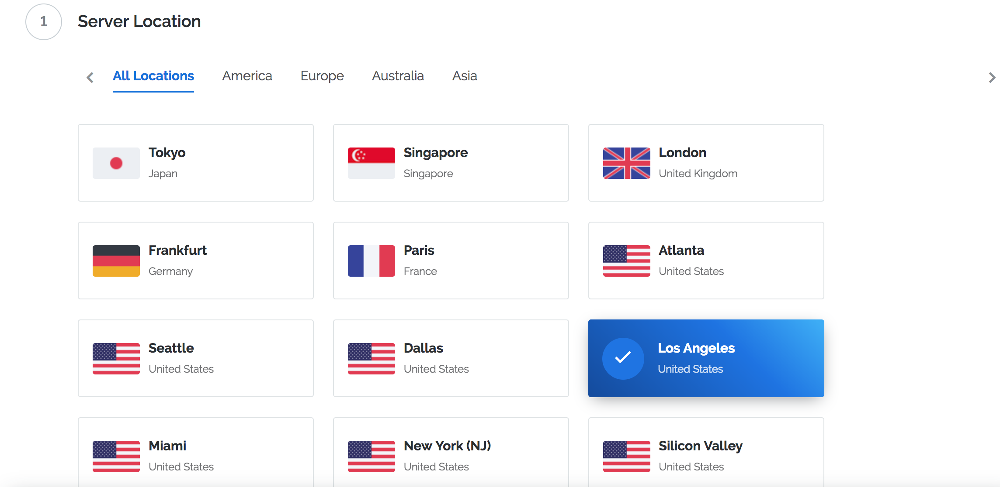

系统的话选的是Ubuntu最新的版本：
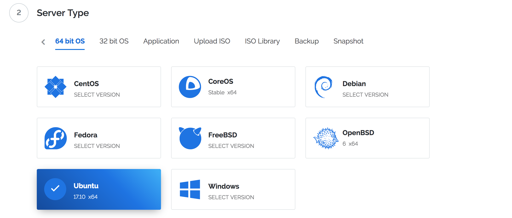

套餐就选$5每月的，单核CPU，1G内存，1000G带宽，完全够用：
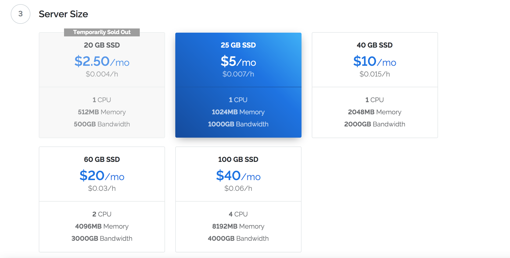

最后设置一下实例名称，然后点击deploy now就开始进行构建了：
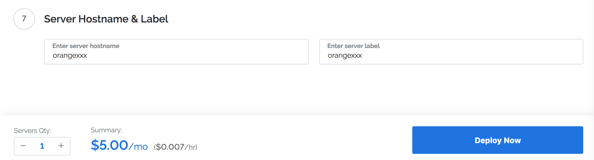

* 远程连接


当状态变为running时就说明实例构建完成，可以点击Manage查看实例详情，在详情页我们可以看到实例的一些基本信息包括ip，root密码等等。

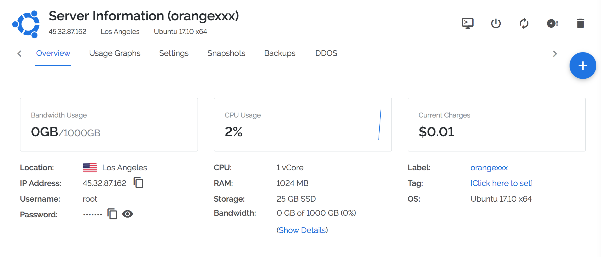

这时候我们可以ping一下我们的VPS看能否ping通

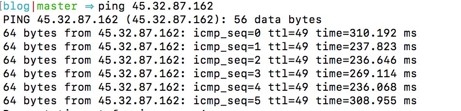

Ok没问题可以ping通，window一般使用类似xshell的客户端来远程连接VPS，我用的是MAC所以直接用ssh连接。
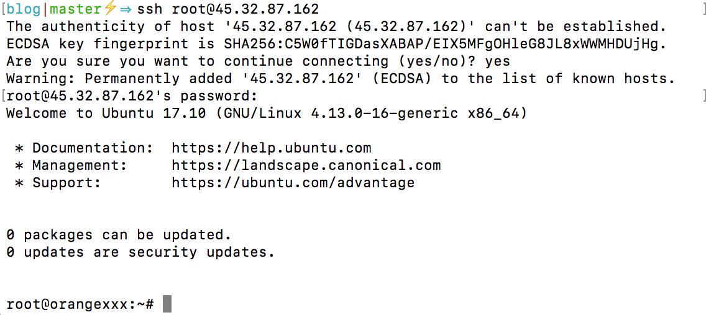

* 修改root密码

登录VPS后习惯修改密码，一方面Vultr自动生成的密码比较复杂，拷贝起来比较麻烦，另一方面出于安全考虑，换个密码安心点：
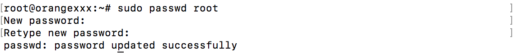

* 安装oh my zsh

习惯在linux系统中使用 oh my zsh，可以让终端既美观又实用，所以这边顺便也讲一下oh my zsh的安装吧。

安装oh my zsh前需要先安装zsh：

0. ```sudo apt-get install zsh``` 安装zsh;
0. ```zsh --version``` 确认是否安装成功;
0. ```sudo chsh -s $(which zsh)``` 设置zsh为默认shell;
0. 注销重新登录
0. ```echo $SHELL``` 确认zsh是否是默认SHELL，输出```/usr/bin/zsh```

zsh安装完成以后就可以安装oh my zsh了：
```
sh -c "$(curl -fsSL https://raw.github.com/robbyrussell/oh-my-zsh/master/tools/install.sh)"
```

大功告成：
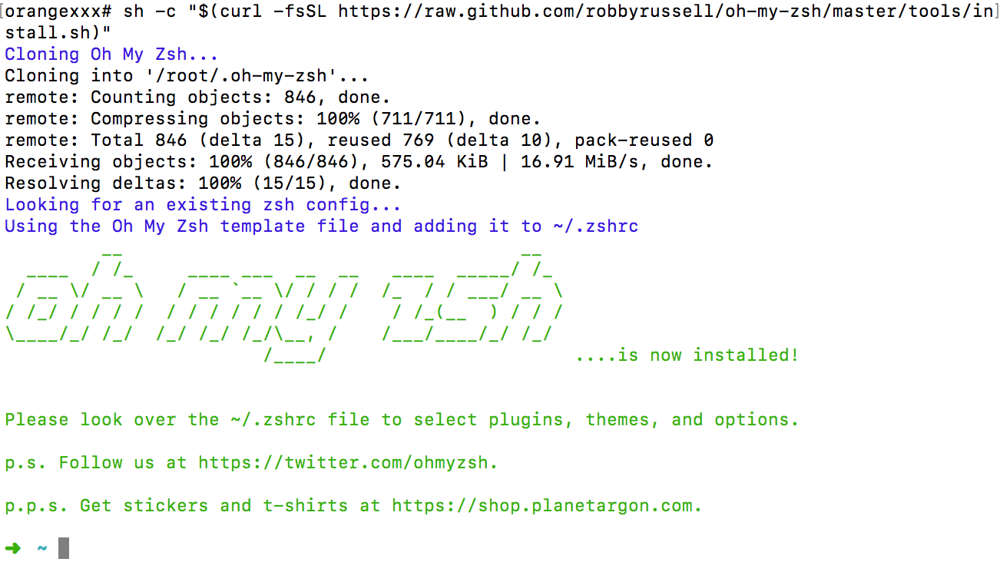

## SSR
SS是clowwindy最先开发的一个通过混淆算法绕过嗅探，总而达到科学上网的工具，后来clowwindy被请去喝茶，SS停止更新了，然后breakwa在SS上新开SSR分支，自立门户，后来SS又复活了，重新开更，变成shadowsocks-libev，各种八卦还是蛮多的，这里就不细究了，这里也不做技术介绍，只是讲讲SSR使用方法。

### 服务端
SS和SSR都是C/S模式，所以我们首先要在VPS上搭建SSR服务。

首先在我们的VPS上安装一个wget

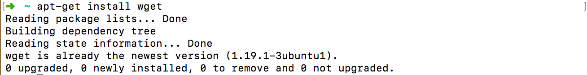

下载一个SSR的sh命令行工具可以方便地创建账号，开启服务，修改配置等等。
```
wget -N –no-check-certificate https://softs.fun/Bash/ssr.sh && chmod +x ssr.sh && bash ssr.sh
```
备用地址：
```
wget -N –no-check-certificate https://raw.githubusercontent.com/ToyoDAdoubi/doubi/master/ssr.sh && chmod +x ssr.sh && bash ssr.sh
```
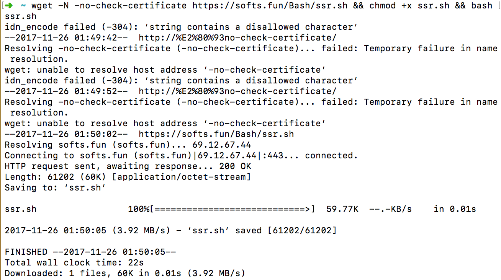

运行 ```bash ssr.sh``就可以打开命令行工具了。

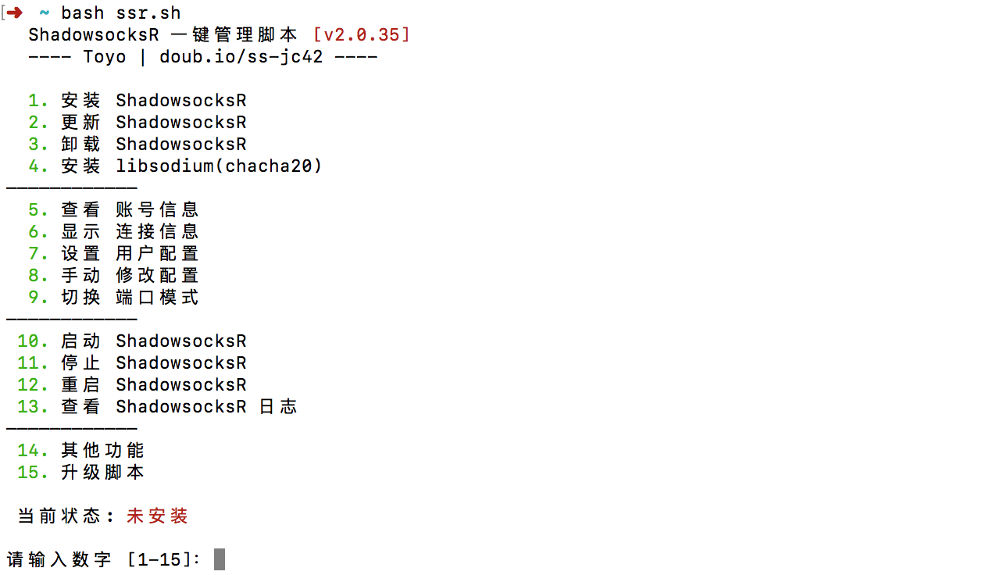

那么现在我们就来安装SSR了，输入1进入安装，并设置端口号。

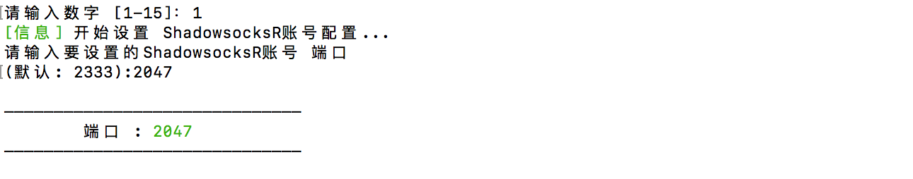

创建账号，需要设置密码。

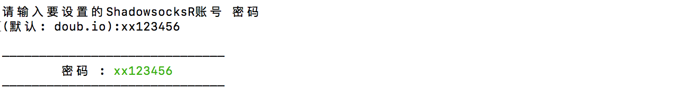

选择加密方式

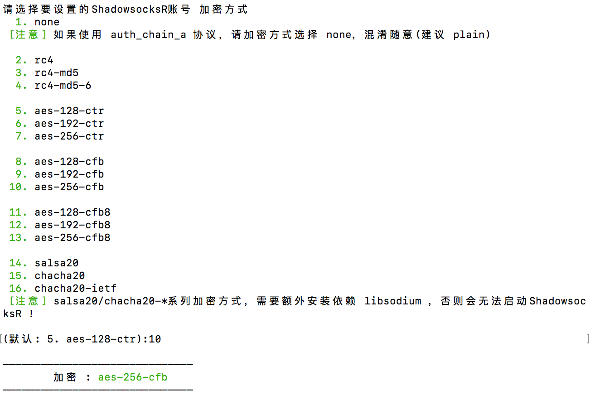

接下来选择协议插件

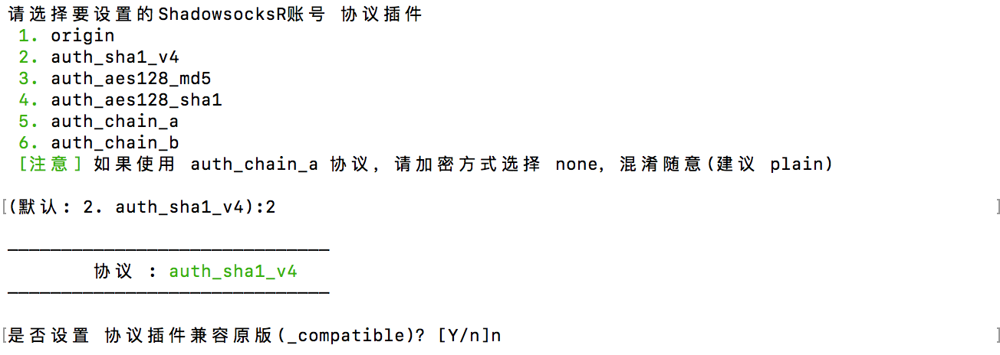

接下来提示你是否选择兼容原版，这里的原版指的是SS客户端，可以根据需求进行选择，原则上不推荐使用SS客户端，所以我选择了n。

混淆插件我们选择tls1.2_ticket_auth，是否兼容原版，否就好了。

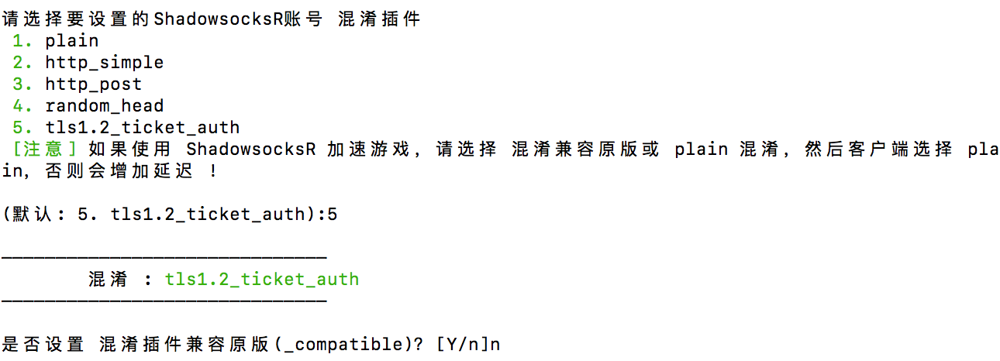

最后会有一系列的设备限制数、单线程限速和端口总限速的设置，直接回车使用默认选项就好了。

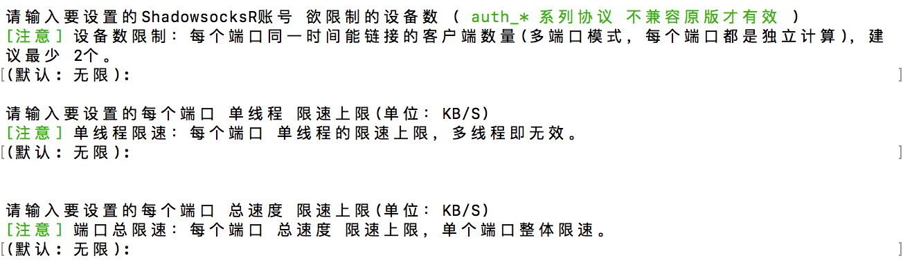

到目前为止，我们的SSR服务端已经搭建完成，终端上会打印我们的所有配置信息。

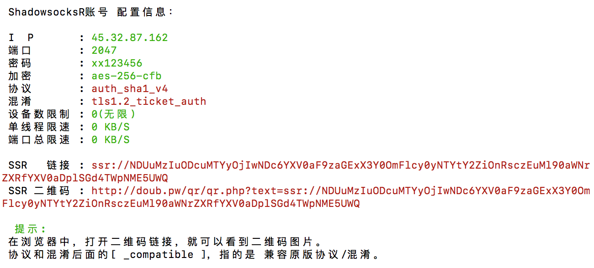

### 客户端
我们需要在本地电脑上下载客户端程序。
* window SSR客户端 [下载地址](https://github.com/shadowsocksr-backup/shadowsocksr-csharp/releases) [备用地址](https://nofile.io/f/6Jm7WJCyOVv/ShadowsocksR-4.7.0-win.7z)
* MAC SSR客户端 [下载地址](https://github.com/shadowsocksr-backup/ShadowsocksX-NG/releases) [备用地址](https://nofile.io/f/jgMWFwCBonU#ab0d3c3b6ac54482)
* Linux SSR 客户端 [一键安装配置脚本（使用方法见注释）](https://github.com/the0demiurge/CharlesScripts/blob/master/charles/bin/ssr) [客户端地址](https://github.com/erguotou520/electron-ssr/releases)
* Android SSR 客户端 [下载地址](https://github.com/shadowsocksr-backup/shadowsocksr-android/releases) [备用地址](https://nofile.io/f/GRWw7PbADrc#1c6c32f969e7f5d9)
* IOS 客户端 Potatso Lite、Potatso、shadowrocket都可以作为SSR客户端，但这些软件目前已经在国内的app商店下架，请用美区的appid账号来下载，网络上有申请国外appid的教程或者淘宝购买。

安装好以后 就可以这设置服务端信息了，这里用MAC版本。
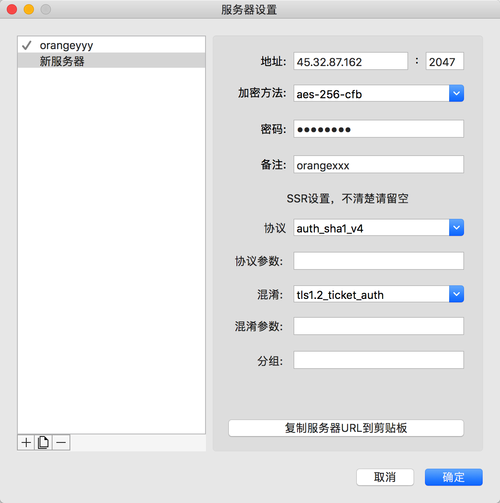

完成设置以后，为了简单期间，我们将模式设置为全局模式，然后打开SSR。
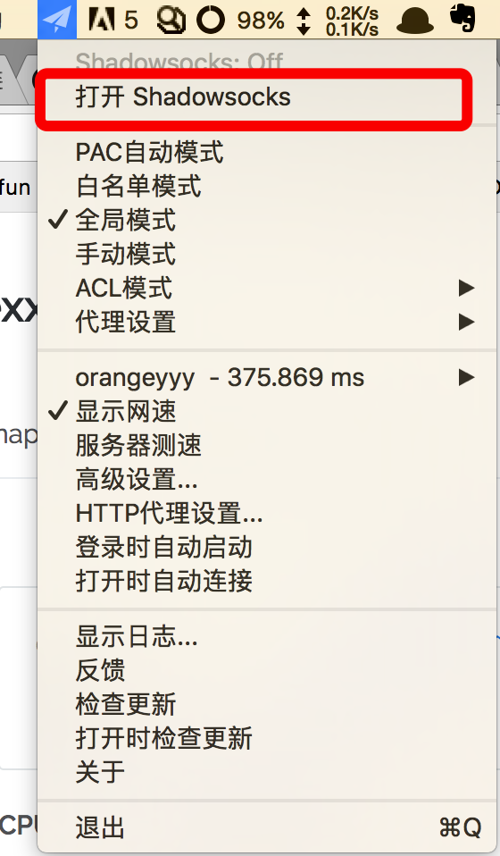

最后我们设置电脑的代理，记住端口固定是1080，并不是我们设置的服务端端口，接下来就可以在墙外自由翱翔了。
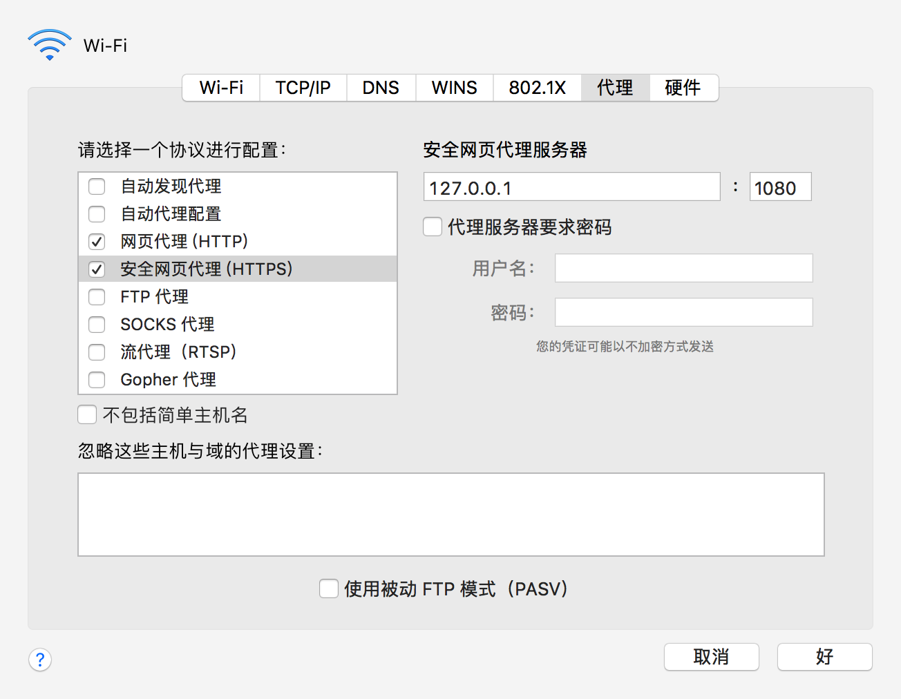

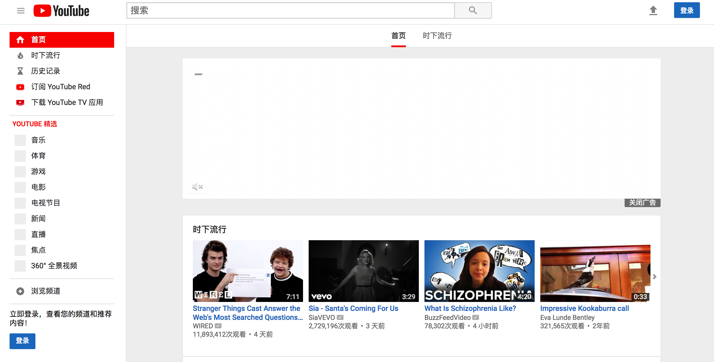

## 加速VPS
此加速教程为谷歌BBR加速,Vultr的服务器框架可以装BBR加速，加速后对速度的提升很明显，所以推荐部署加速脚本。该加速方法是开机自动启动，部署一次就可以了。

```
wget –no-check-certificate https://github.com/teddysun/across/raw/master/bbr.sh
```
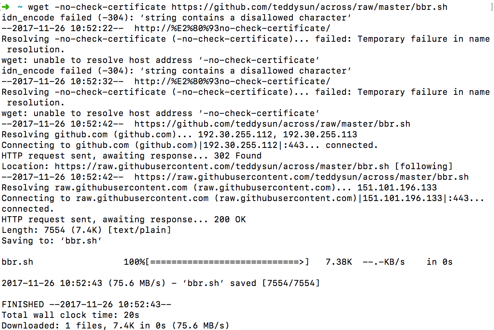
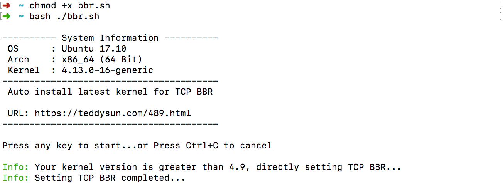

## 总结
VPS还有很多其他的用法等着我们去探索，科学上网是第一步，也是基本保障，科学上网，拒绝黄赌毒。

## 参考
* https://github.com/shadowsocks/shadowsocks/tree/master
* https://github.com/clowwindy/shadowsocks-libev/blob/master/README.md
* https://github.com/shadowsocksr-backup/shadowsocksr
* http://zhaoweihao.me/2017/11/04/%E8%87%AA%E5%BB%BAssr%E6%9C%8D%E5%8A%A1%E5%99%A8%E6%95%99%E7%A8%8B/
* http://bbs.itzmx.com/thread-12670-1-1.html
* http://www.laozuo.org/myvps
* http://www.jianshu.com/p/9a5c4cb0452d