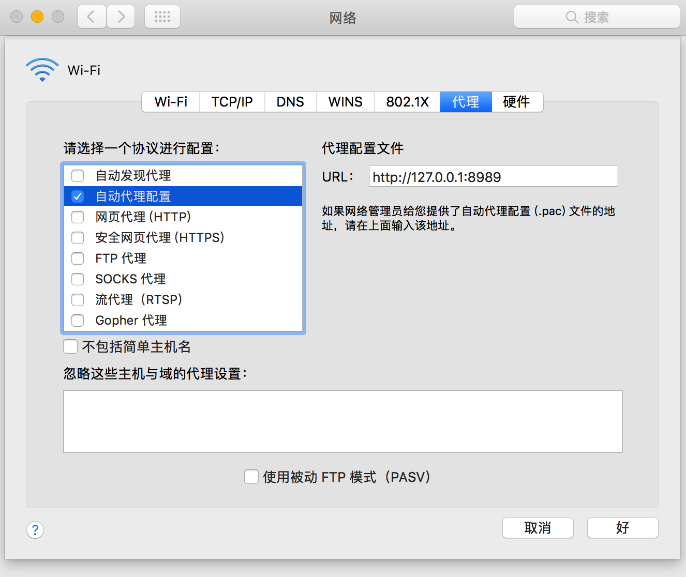

# PAC

## 概述
PAC（Proxy auto-config）是一种网页浏览器技术，用于定于浏览器该如何自动选择合适的代理服务器来访问一个网址。一个PAC文件包含一个含有```FindProxyForURL(url, host)```函数的js文件，这个函数返回一个或多个访问规则的字符串。浏览器在访问其他页面之前会先访问PAC文件，PAC文件中URL可能是手工配置的，也可能是通过网页的**网络代理自动发现协议(WPAD)**自动配置的。

浏览器代理的常用配置方式：
* 手动代理配置；
* 代理自动配置（PAC）;
* 网络代理自动发现协议（WPAD）；

## 使用方式
### 代理设置
使用PAC，需要在一个服务器上发布一个PAC文件（当然也可以在本地搭一个服务），然后在浏览器的代理配置里面输入PAC文件的URL或者通过WPAD协议告诉用户代理去使用这个文件，下图为MAC下的配置方式：


### FindProxyForURL
PAC文件中最重要的就是```FindProxyForURL(url, host)```函数，其中url为一个对象的URL，host为这个URL派生的主机名，一个简单的栗子：
```javascript
function FindProxyForURL(url, host) {
  return 'PROXY proxy.example.com:8080; DIRECT';
}
```
这个函数告诉浏览器通过服务器proxy.example.com的8080端口来获取所以的页面，如果这个代理服务器没有反应，那么浏览器就直接请求目标页面，而不是通过代理服务。

## PAC语法&函数
### 指令
PAC的FindProxyForURL函数的return主要包含以下3种指令：
* DIRECT： 表示无代理直接连接；
* PROXY host:port：表示走host:port的proxy服务；
* SOCKS host:port：表示走host:port的socket服务；

### 函数
#### dnsDomainIs
判断域名是否在等于给定字符串。
```javascript
if (dnsDomainIs(host, 'google.com') || dnsDomainIs(host, 'www.google.com')) {
  return 'DIRECT';
}
```
#### shExpMatch
shell正则匹配。
```javascript
if (shExpMatch(url, 'http://www.google.com/folder/*')) {
  return 'DIRECT';
}
```

#### dnsResolve
通过DNS查询主机IP,通常和isInNet配合使用。
```javascript
if (isInNet(dnsResolve(host), '10.0.0.0', '255.0.0.0')) {
  return 'DIRECT';
}
```

#### isInNet
判断是否在网段内，比如10.1.0.0这个网段，10.1.1.0就在其中，如上面那个例子。

#### myIpAddress
返回主机的IP。

#### isPlainHostName
判断主机名是否包含域名，若不包含返回true；
```javascript
isPlainHostName('www') //返回true；
isPlainHostName('www.google.com') //返回false；
```

#### isResolvable
判断主机是否可访问
```javascript
if (isResolvable(host)) {
  return 'PROXY proxy.example.com:8080';
}
```

#### dnsDomainLevels
返回是几级域名，比如dnsDomainLevels(http://barretlee.com) 返回的结果就是 1。
```javascript
if (dnsDomainLevels(host) > 0) {
  return 'PROXY proxy.example.com:8080';
}
```
#### weexdayRange
星期判断。
```javascript
if (weexdayRange('MON', 'FRI')) {
  return 'PROXY proxy.example.com:8080';
}
```
#### dateRange
日期判断。
```javascript
if (dateRange('JAN', 'MAR')) {
  return 'DIRECT';
}
```

#### timeRange
时间判断。
```javascript
if (timeRange(8, 18)) {
  return 'DIRECT';
}
```

#### alert
据说可以调试。
```javascript
alert(host);
```

## WPAD
WPAD（Web Proxy Auto-Discovery protocol）通过浏览器自动发现代理服务器，使代理服务对用户透明，WPAD可以借助DNS服务器或者DHCP服务器来查询PAC文件。
## 参考

* https://zh.wikipedia.org/wiki/%E4%BB%A3%E7%90%86%E8%87%AA%E5%8A%A8%E9%85%8D%E7%BD%AE
* https://zhuanlan.zhihu.com/p/22166179
* https://www.ibm.com/developerworks/cn/linux/1309_quwei_wpad/