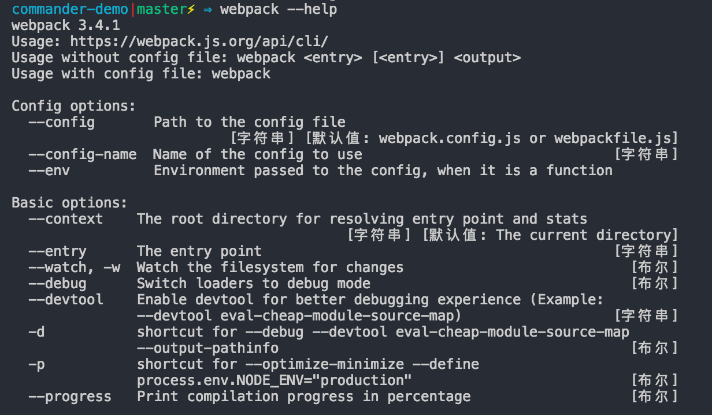
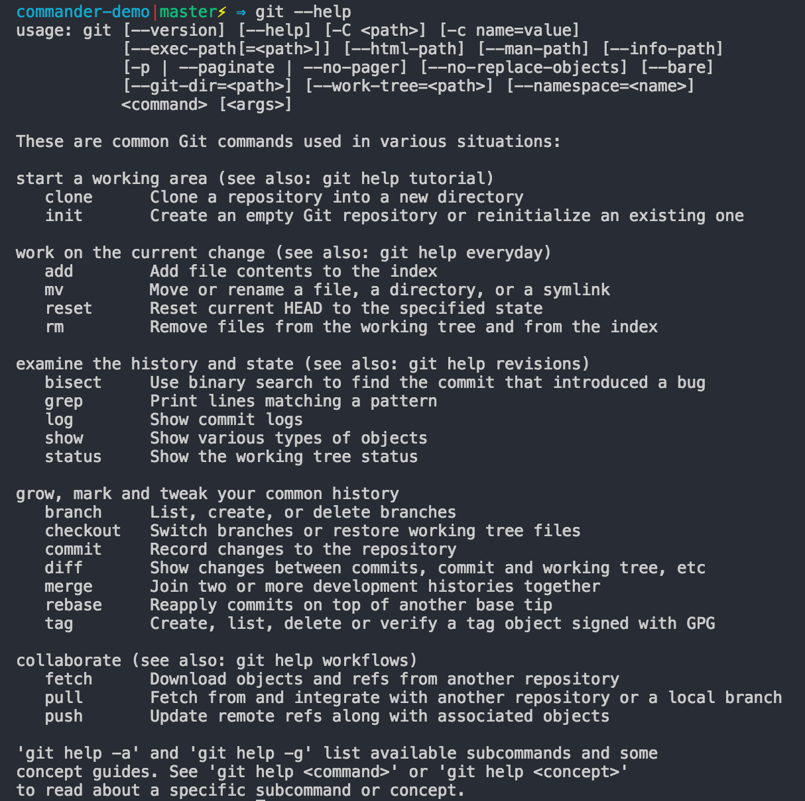
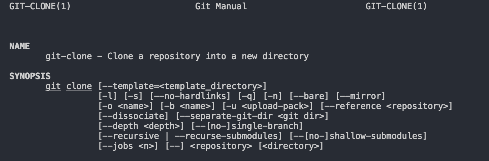
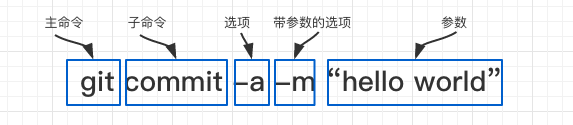

# commander

[commander](https://github.com/tj/commander.js)是一个用node实现的用于命令行的解决方案，主要为了让开发同学能够方便快速的开发命令行工具。它主要借鉴ruby的[commander](https://github.com/commander-rb/commander)库，[API文档](http://tj.github.io/commander.js/)。

## 命令行
命令行工具大家都不陌生，平时在终端中使用的都是命令行，但是很少会详细钻研命令行中到底有哪些内容，哪些规则，以及作为一个命令行工具，应该具备哪些东西，这次借这个机会先好好了解一下命令行。
命令行工具主要分为两类，单命令和多命令， 我们可以通过命令行工具的--help轻松查看命令行工具的功能：
* 单命令，很好理解，就是一个命令行工具只做一件事，但是可以支持多种参数，比较典型的是Webpack:

* 多命令，这个比较常见，因为命令行工具往往不仅仅是做一件事，例如Git，其中add、commit、push、pull等等都是他的子命令，如下我们可以看看git的help文档：

我们也可以看到，git为每一个子命令也提供了非常详细的帮助文档, 下面的截图只是截了很小一部分：

### 结构
通过上面的例子我们可以大致了解命令行工具的大致情况，现在我用一个具体的例子来说明命令行中各个部分的作用，下面这个命令是我们比较常用的一个git命令，主要用于提交修改后的代码：

* **主命令** 主命令往往是命令行工具的名称。
* **子命令** 子命令应该是属于命令行工具的一个功能子集，主要告诉命令行工具要做什么操作，同时支持选项设置；
* **选项** 如果把子命令比作命令行工具中的一个函数的话，选项就是这个函数的入参，告诉子命令该用什么规则执行；
选项一般包含两种形式：
  * 长选项：长选项往往是一个单词或者一个词组一句话，用“--”开头，这样可以信息表达选项的意思，例如 `--message`,如果是一句话或一个词组单词间的空格可以用“-”隔开，例如`--allow-empty`;
  * 短选项：可以理解为是长选项的缩写，只有一个单词，对于比较常用的选项，用户更倾向于使用短选项，短选项用“-”开头，例如`-a`、`-m`，短选项也可以复合使用，例如`-am`;

* **参数** 如果把选项比作函数的入参，那么参数就是函数的实参，告诉函数具体传入什么值，对于bool类型的选项，一般不需要传入值，但是对于字符串类型的选项一般需要传入参数例如上面例子中的`-m`的选项。在命令行中参数一般紧跟在选项后面用空格隔开，有时候也可以用等号隔开，例如`--message="hello"`
  
### 特殊字符
**命令 <必选参数1|必选参数2> [-option {必选参数1|必选参数2|必选参数3}] [可选参数...] {(默认参数)|参数|参数}**

命令行说明文档中一般包含很多特殊字符，这里对特殊字符简单介绍，对于阅读命令行说明文档非常重要：
* **尖括号< >** 必选参数，实际使用时应将其替换为所需要的参数；
* **大括号{ }** 必选参数，内部使用，包含此处允许使用的参数；
* **方括号[ ]** 可选参数，在命令中根据需要加以取舍；
* **小括号( )** 指明参数的默认值，只用于{ }中
* **竖线|** 用于分隔多个互斥参数，含义为“或”，使用时只能选择一个；
* **省略号...** 任意多个参数；

## 接口文档

### 选项

### 子命令

### 帮助文档

