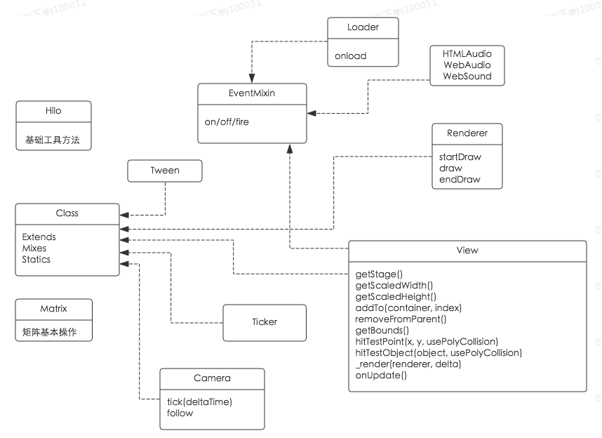
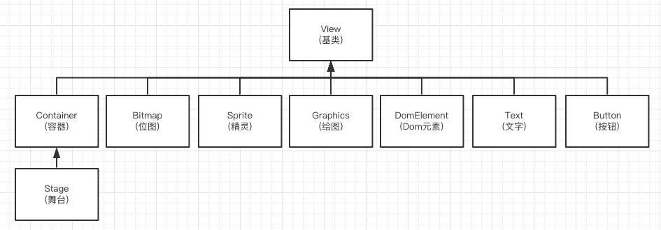
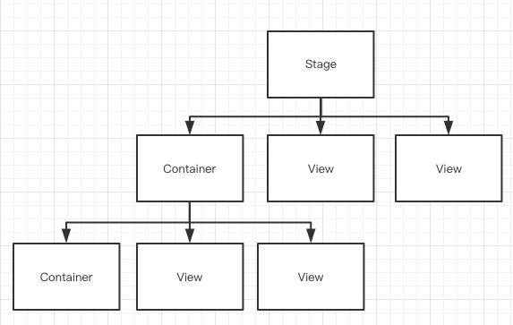
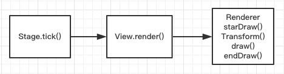

# Hilo

[Hilo](http://hiloteam.github.io/index.html)是阿里开发的一套完整跨终端互动游戏解决方案，提供包括DOM，Canvas，Flash，WebGL等多种渲染方案，非常轻量，无外部依赖且接口简单易懂。

## 概述
Hilo的内核结构比较简单，如下图所示：



Hilo提供模块化支持，主要通过Class.create创建对象:
```javascript
var SomeClass = Class.create({
    Extends: ParentClass,
    Mixes: SomeMixin,
    Statics: SomeStatics,
    constructor: Constructor,
    propertyName: propertyValue,
    methodName: methodValue 
});
```
其中：
* Extends: 指定一个父类；
* Mixes: 指定混入对象。可以是Object或是Array；
* Statics: 指定对象的静态属性;
* constructor: 创建类的构造函数;

此外 Hilo 使用 Class.mix(target, [mixinObject])，可以为target混入属性和方法。

## 资源加载
映像中在进入游戏之前往往有一个加载界面，这个加载界面的作用是在游戏开始之前预加载游戏所需的素材资源，以免在游戏过程中实时加载影响游戏的流畅性，Hilo中也提供类似的功能，用[LoadQueue](http://hiloteam.github.io/Hilo/docs/api-zh/symbols/LoadQueue.html)来实现。LoadQueue只是一个加载队列，具体资源加载需要对应的loader来完成，Hilo主要实现了两种loader： ImageLoader和ScriptLoader。

现在让我们来看一下LoadQueue如何使用：

LoadQueue提供一个构造函数，用于初始化资源队列：LoadQueue(source:Object)，source可以为一个资源对象，也可以是一个资源数组，资源的具体结构如下：
* id： 资源的唯一标识，用于在下载队列中定位指定资源；
* src：资源下载地址；
* type： 资源类型，默认根据文件后缀进行类型判断，不同资源类型使用不同的加载器来加载资源；
* loader：资源加载器，默认会根据资源类型自动选择加载器，当然也可以自己指定；
* noCache：指示记载资源时是否需要增加时间戳参数来防止缓存；
* size：资源对象的预计大小，可以预估下载进度；

LoadQueue提供add(source:Object|Array)方法往资源列表中增加资源。此外LoadQueue提供一系列方法来获取资源信息：
* get(id:String):Object：根据id或src获取资源对象，当资源队列加载过程中会为资源对象增加如下属性：
  * content：资源内容；
  * loaded: 资源加载成功；
  * error: 资源加载失败信息；
* getContent(id:String):Object: 根据id或src获取资源内容：
* getLoaded():Uint: 获取已下载的资源数量；
* getTotal():Uint: 获取所有资源数量；
* getSize(loaded:Boolean):Number: 获取全部或已下载的资源的字节大小，以上3个方法在获取资源加载进度时非常有用；

由于QueueLoader使用了EventMixin,所以它拥有事件触发及监听能力。QueueLoader包含以下事件类型：
* load: 当一个资源加载完成会触发，对象参数为加载成功的资源对象；
* error：当一个资源加载失败是会触发，对象参数为加载失败的资源对象；
* complete：当资源队列加载完成时会触发；

QueueLoader提供一个属性maxConnections用于控制同时最大连接数，最后QueueLoader提供start()方法开始下载资源队列。

如果需要自己实现一个loader只需要提供3个接口就可以了：
* load： 用于接受资源对象进行资源加载；
* onLoad： 加载成功时回调；
* onError: 加载失败时回调；

## 可视元素
Hilo的所有可是元素都是基于基础类View，通过下图我们可以看出Hilo中可是元素的继承关系：



而Hilo的整体结构与HTML的DOM树十分类似，可以如下图所示，所有的内容都在同一个stage里面，所以stage类似HTML中的body，container中可以放view也可以嵌套container，所以container类似HTML的div：



Hilo的整个渲染过程开始于Stage，当调用Stage的tick方法后，会遍历整个Hilo树，逐个调用可视对象的render方法，而具体的渲染是交由对应的渲染器Renderer完成，计时器Ticker会按照设定的fps频率不断地重复调用此渲染过程，由于Renderer只会注入Stage,可是对象只需调用Renderer的统一接口，因此，可视对象和渲染实现基本接口：




那么我们首先来看一下[View](http://hiloteam.github.io/Hilo/docs/api-zh/symbols/View.html)都提供了哪些接口：

**属性**
  * align: 可视对象相对父容器的对齐方式，详见Hilo.align;
  * alpha: 可视对象透明度；
  * background: 可视对象的背景样式,可以是css颜色值、canvas的gradient或pattern填充；
  * boundsArea: 可视对象的区域顶点数组，如[{x: 10, y: 10}, {x: 20, y: 20}];
  * depth: 可视对象的深度，类似z-index, 只读属性；
  * drawable: 可视对象的可绘制对象??；
  * height: 可视对象的高度；
  * id: 可视对象的唯一标识；
  * mask: 可视对象的遮罩图形??；
  * onUpdate: 此方法会在可视对象渲染之前调用，函数返回boolean类型，若false，对象不渲染；（若在此函数中改变了其在父容器中的层级，当前渲染帧不会正确渲染，而是下一帧渲染，所以这种操作可以放在其父容器的onUpdate中实现）
  * parent: 父容器，只读对象；
  * pivotX: 中心点X轴坐标；
  * pivotY: 中心点Y轴坐标；
  * pointerEnabled: 可视对象是否接受交互事件，默认true；
  * rotation: 可视对象旋转角度;
  * scaleX: X轴缩放比例;
  * scaleY: Y轴缩放比例;
  * tint: 可视对象的附加颜色，默认0xFFFFFF，只支持webgl模式??；
  * visible: 是否可见；
  * width: 可视对象宽度；
  * x: 可视对象X轴坐标；
  * y: 可视对象Y轴坐标；

**方法**
  * addTo(container:Container, index:Uint):View: 添加到父容器；
  * getBounds():Array: 获取可视对象在舞台全局坐标系中的外接矩形及所有定点坐标；
  * getScaledHeight():Number: 获取可视对象缩放后的高度；
  * getScaledWidth():Number: 获取可视对象缩放后的宽度；
  * getStage():Stage: 获取舞台引用;
  * hitTestObject(object:View, usePolyCollision:Boolean): 监测object参数指定的对象是否与其相交;
  * hitTestPoint(x:Number, y:Number, usePolyCollision:Boolean):Boolean: 检测x和y参数指定的点是否在其外接矩形内部；
  * removeFromParent():View: 从父容器里删除此对象;
  * render(renderer:Renderer, delta:Number): 可视对象的渲染逻辑, 子类通过覆盖这个方法实现自己的渲染, 其中renderer是渲染器，delta为渲染时时间偏移量;
  * toString():String: 返回可视对象的字符串表示；

同时View还是用了EventMixin所以拥有事件触发及监听功能。

### [Container](http://hiloteam.github.io/Hilo/docs/api-zh/symbols/Container.html)
Container是所有容器类的基类，每个Container都可以添加其他可视对象， Container的接口比较简单。

**属性**
  * children: 容器的子元素列表，只读属性；
  * clipChildren: 是否裁剪超出容器范围的子元素，默认false;
  * pointerChildren: 子容器是否相应用户交互事件，默认true;

**方法**
  * addChild(child:View): 在最上面添加子元素;
  * addChildAt(child:View, index:Number): 在指定索引位置添加子元素;
  * contains(child:View): 返回是否包含参数指定的子元素;
  * getChildAt(index:Number): 返回指定索引位置子元素;
  * getChildById(id:String): 获取指定id的子元素;
  * getChildIndex(child:View): 获取指定子元素的索引;
  * getNumChildren():Uint: 获取容器子元素的数量;
  * getViewAtPoint(x:Number, y:Number, usePolyCollision:Boolean, global:Boolean, eventMode:Boolean): 返回坐标为(x, y)下的对象；
    * usePolyCollision：指定是否使用多边形碰撞检测，默认false??;
    * global: 使用此标志表明将查找所有符合的对象，而不仅仅是第一个,默认false;
    * eventMode: 使用此标志表明将在事件模式下查找对象。默认为false??
  * removeAllChildren():Container: 删除所有子元素;
  * removeChild(child:View):View: 删除指定子元素;
  * removeChildAt(index:Int):View: 删除指定索引的子元素;
  * removeChildById(id:String):View: 删除指定id的子元素;
  * setChildIndex(child:View, index:Number): 设置子元素的索引位置；
  * sortChildren(keyOrFunction:Object): 根据指定键值或函数对子元素排序;
  * swapChildren(child1:View, child2:View): 交换两个子元素位置;
  * swapChildrenAt(index1:Number, index2:Number): 交换两个索引对应的子元素位置;

### [Stage](http://hiloteam.github.io/Hilo/docs/api-zh/symbols/Stage.html)
Stage是所有可视对象的根节点，可视对象只有插入到Stage或Stage的子对象中才能被渲染；

**属性**
  * canvas: 舞台对应的画布，可以是一个canvas或一个普通div，只读属性
  * paused: 指示舞台是否停止刷新；
  * renderer: 舞台的渲染器，只读属性;
  * viewport: 舞台内容在页面中的渲染区域，包含属性有：left、top、width、height，只读属性；

**方法**
  * addTo(domElement:HTMLElement):Stage: 覆盖了View的addTo方法，将舞台加到Dom容器中；
  * enableDOMEvent(type:String|Array, enabled:Boolean):Stage: 开启/关闭Stage的DOM事件响应，支持的交互有：
    * POINTER_START
    * POINTER_MOVE
    * POINTER_END
  * resize(width:Number, height:Number, forceResize:Boolean): 改变Stage大小，forceResize指定是否强制改变舞台大小，即不管舞台大小是否相同，仍然强制执行改变动作，可确保舞台、画布以及视窗之间的尺寸同步；
  * tick(delta:Number): 调用tick触发舞台更新，一般不需要手动调；
  * updateViewport():Object: 更新Stage在页面中的可是区域，当舞台canvas的样式border、margin、padding等属性更改后，需要调用此方法更新舞台渲染区域。

### [Bitmap](http://hiloteam.github.io/Hilo/docs/api-zh/symbols/Bitmap.html)
Bitmap用于表示位图图像类，这个应该是Hilo中最常用的可视元素了。

**属性**
  * image: 对应的图像内容；
  * rect: 指定位图在图片image的矩形区域，例如[0, 0, 100, 100];

**方法**
  * setImage(image:Image|String, rect:Array):Bitmap: 设置位图图片;

### [Sprite](http://hiloteam.github.io/Hilo/docs/api-zh/symbols/Sprite.html)
Sprite又名动画精灵，是Hilo中动画最常用的实现方法, Sprite就是一些列的Frame进行逐帧播放，frame的结构如下：
  * image: 位图内容；
  * rect: 指定位图在图片image的矩形区域;
  * name: 当前帧的名称标识；
  * duration: 当前帧的停留时长，若无则使用sprite的interval；
  * stop: 结束帧标识;

**属性**
  * currentFrame: 当前播放帧的索引,只读属性;
  * interval: 精灵动画的帧间隔，若timeBased为true，则单位为毫秒，否则为帧数;
  * loop: 是否循环播放，默认true；
  * onEnterFrame: 动画播放头进入新帧时回调，已废弃，请用addFrameCallback；
  * paused: 判断精灵动画是否暂停，默认false;
  * timeBased: 是否以时间为基准，默认false，即帧为基准；

**方法**
  * addFrame(frame:Object, startIndex:Int):Sprite: 往精灵动画中增加帧；
  * getFrame(indexOrName:Object):Object: 获取精灵动画中的指定帧；
  * getFrameIndex(frameValue:Object):Object: 获取精灵动画中指定帧的索引；
  * getNumFrames():Uint: 获取总帧数;
  * goto(indexOrName:Object, pause:Boolean):Sprite: 跳转到精灵动画指定帧;
  * play():Sprite: 开始播放;
  * setFrame(frame:Object, index:Int):Sprite: 设置精灵动画指定索引位置的帧；
  * setFrameCallback(frame:Int|String, callback:Function):Sprite: 设置指定帧的回调函数，当精灵动画进入指定帧时回调；
  * stop():Sprite: 停止播放;

提到Sprite就不得不提到[TextureAtlas](http://hiloteam.github.io/Hilo/docs/api-zh/symbols/TextureAtlas.html),他是一个纹理管理工具，可以方便的从TextureAtlas中获取纹理小图或者精灵动画。我们来看一下如何构造一个纹理集：

TextureAtlas(atlasData:Object)

altlasData: 纹理集数据;
  * image: 纹理集图片,必需；
  * width: 纹理集图片宽度，若frames数据为object时，此属性必须；
  * height: 纹理集图片高度，若frames数据为object时，此属性必须；
  * frames：纹理集帧数据，可以为Array或者Object:
    * 若为Array，为帧数据的rect数组，如[[0, 0, 50, 50], [0, 50, 50, 50]];
    * 若为Object，需包含则需包含frameWidth(帧宽)、frameHeight(帧高)、numFrames(帧数) 属性，纹理集会根据以上属性进行切割；
  * sprites: 纹理集精灵动画定义，每一个值对应一个精灵动画：
    * 若为Number，表明精灵动画只有一帧，如{'foo':1}；
    * 若为Array, 则每一项都为一个帧的索引值，如{'foo':[0, 1, 2, 3]}；
    * 若为Object，包含from(起始帧索引值), to(末帧索引值)属性。

TextureAtlas提供以下方法：
  * getFrame(index:Int):Object: 获取指定索引的帧数据;
  * getSprite(id:String):Object: 获取指定id的精灵索引；

另外TextureAltlas还提供一个快速创建精灵的静态方法

> [Static] createSpriteFrames(name:String|Array, frames:String, image:imgElem, w:Number, h:Number, loop:Bollean, duration:Number, duration)

```javascript
 //方式一 单个动画
 createSpriteFrames("walk", "0-5,8,9", meImg, 55, 88, true, 1);
 //方式二 多组动画
 createSpriteFrames([
   ["walk", "0-5,8,9", meImg, 55, 88, true, 1],
   ["jump", "0-5", meImg, 55, 88, false, 1]
 ]);
```
  * name:String|Array — 动画名称|一组动画数据
  * frames:String — 帧数据 eg:"0-5"代表第0到第5帧
  * image: 图片内容
  * w:Number — 每帧的宽
  * h:Number — 每帧的高
  * loop:Bollean — 是否循环
  * duration:Number — 每帧间隔 默认单位帧, 如果sprite的timeBased为true则单位是毫秒，默认一帧

### [Text](http://hiloteam.github.io/Hilo/docs/api-zh/symbols/Text.html)
文本就不多说了，主要实现了简单的文本显示功能，复杂的问题功能可以使用DOMElement，另外文本在canvas模式下性能比较差，且会出现模糊的情况，建议不要使用。

**属性**
  * color: 字体颜色；
  * font: 文本的字体css样式，只读属性，需要通过setFont方法设置；
  * lineSpacing: 文本行距；
  * maxWidth: 指定文本的最大宽度，默认200；
  * outline: 指定文本是绘制边框，还是填充？？；
  * text: 文本内容；
  * textAlign: 文本对齐方式,必须设置宽度才生效，可以为： 'start'、‘end’、‘left’、‘right’和‘center’；
  * textHeight: 文本内容的高度，只读属性，貌似不起作用；
  * textVAlign: 垂直对齐方式，必须设置高度才生效，可以为：‘top’、‘middle’、‘bottom’
  * textWidth: 文本内容宽度，只读属性，貌似不起作用;

**方法**
  * cache(forceUpdate:Boolean):缓存到图片里，提供渲染性能，详见CacheMixin；
  * setCacheDirty(dirty:Boolean): 设置缓存是否dirty;
  * setFont(font:String):Text:设置字体css样式，[参考](http://www.w3school.com.cn/cssref/pr_font_font.asp)
  * updateCache(): 更新缓存；
  * measureFontHeight(font:String):Number: static方法,测算指定字体样式行高；

## 动画效果
缓动动画是游戏中比较常用的功能，通过设置不通的缓动变化函数，可以制作出各种变化的缓动效果。

### [Tween](http://hiloteam.github.io/Hilo/docs/api-zh/symbols/Tween.html)
Hilo中通过Tween提供缓动功能，通常Tween作用于view，来使view具有缓动效果。

**属性**
* delay: 缓动延迟时间，单位毫秒;
* duration: 缓动时长，单位毫秒;
* ease: 缓动变化函数, 默认为null;
* loop: 是否循环播放，默认为false;
* onComplete: 缓动结束时回调，它接受一个参数：tween;
* onStart: 缓动开始时回调，它接受一个参数：tween；
* onUpdate: 缓动更新回调，它接受两个参数: ratio和tween；
* paused: 缓动是否暂停,默认为false;
* repeat: 重复次数，默认为0；
* repeatDelay: 缓动重复的延迟时长，单位毫秒;
* reverse: 缓动是否翻转播放,默认false;
* target: 缓动目标，只读属性;
* time: 缓动已执行的时长，单位毫秒，只读属性；

**方法**
  * link(tween:Tween):Tween：链接下一个Tween变化，其开始时间根据delay值不同而不同。当delay值为字符串且以'+'或'-'开始时，Tween的开始时间从当前变换结束点计算，否则以当前变换起始点计算。
  * pause():Tween：暂停动画播放;
  * resume():Tween: 恢复动画播放；
  * seek(time:Number, pause:Boolean):Tween：跳转到动画的指定时间；
  * setProps(fromProps:Object, toProps:Object):Tween：设置动画的初始和目标属性;
  * start():Tween:启动动画播放;
  * stop():Tween: 停止动画播放;
  * tick():Object[static]:更新所有动画实例;
  * add(tween:Tween):Object[static]:增加动画实例;
  * remove(tweenOrTarget:Tween|Object|Array):Object[static]:删除动画实例;
  * removeAll():Object[static]: 删除所有动画;
  * fromTo(target:Object|Array, fromProps, toProps, params):Tween|Array[static]:创建一个缓动动画，让目标从开始属性变换到目标属性;
  * to(target:Object|Array, toProps, params):Tween|Array[static]:创建一个缓动动画，让目标从当前属性变换到目标属性;
  * from(target:Object|Array, fromProps, params):Tween|Array[static]创建一个缓动动画，让目标对象从指定的起始属性变换到当前属性；

###[Ease](http://hiloteam.github.io/Hilo/docs/api-zh/symbols/Ease.html):
Ease包含为Tween提供的各种缓动函数，详见文档，可以一个个尝试一下。


## 缓存

## Camera


## 事件机制
Hilo提供[EventMixin](http://hiloteam.github.io/Hilo/docs/api-zh/symbols/EventMixin.html)进行事件处理，它的接口非常简单，总共有三个：
* fire(type:String, detail:Object):Boolean: 用于事件发送；
* off(type:String, listener:Function):Object: 用于解除事件监听；
* on(type:String, listener:Function, once:Boolean):Object: 用于增加事件监听；

需要指出的是listener回调函数的参数是一个EventObject类型，主要包含以下信息：
* type: fire函数的第一个参数；
* target: 当前监听对象本身；
* detail: fire函数的第二个参数；
* timeStamp: fire执行的时间戳；