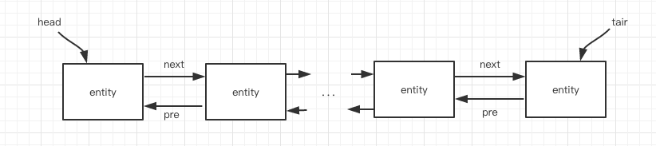

# lru-cache

[lru-cache](https://github.com/isaacs/node-lru-cache)是一个基于LRU的内存缓存工具，接口简单，方便实用。

## LRU（Latest Recently Used）
LRU（即最近最少使用）是一种非常常见的缓存淘汰算法，他的核心思想是：如果数据最近被访问过，那么将来被访问的几率也更高。

## 数据结构
缓存工具比较依赖数据结构，在lru-cache库中主要用到两种数据结构，分别是一个双向链表以及一个Map。
* [yallist](https://github.com/isaacs/yallist)
yallist是通过node实现的一个双向链表，在链表的头部有一个Head指针，在链表的尾部有一个tair指针，链表中每一个元素同时拥有一个pre指针指向元素之前的一个元素，拥有一个next指向元素之后的一个元素，大致可以如图所示：

在lru-cache中yallist主要用于实现LRU，最近被使用的数据如果之前存在，则从列表中找到已存在节点，并删除，然后从head处插入新节点，如果之前不存在，则直接从head处加入列表，当缓存体积超过上限以后，从tair处删除节点，直到缓存体积恢复到最大体积以下。这样一来，双向列表中head处为最近使用的节点，tair处则为长时间未使用过的节点。
* [pseudomap](https://github.com/isaacs/pseudomap)
pseudomap主要是实现了一个类似ES6中Map的功能。在lru-cache中主要用于通过key快速获取值。
## 接口文档
lru-cache的参数及API十分简单，这里一一做一下介绍：
### 参数
* **max**

  Number类型，主要用于设置缓存的最大容量，默认是无限大，不过建议还是设一个值；
* **maxAge**

  Number类型，主要用于设置缓存的过期时间，以ms为单位，缓存在获取数据时会判断数据是否已经过期，若已经过期则返回undefined，这个maxAge是对缓存中的所有数据统一设置过期时间，用户可以通过set方法在存储数据时为每条数据单独设置过期时间，单独设置的过期时间优先级高于统一设置的过期时间；
* **length**
  
   Function类型，是一个尺寸计算方法，默认是function() {return 1;}, 用户可以通过function(value, key) {...}方式告诉缓存工具尺寸计算方法；
* **dispose**
  
  Function类型，一个hook方法，当数据从缓存消除数据的时候回调，由于这个方法是在数据还没消除之前调用的，如果要想在dispose中恢复数据，最好使用setTimeout或者nextTick来设置；
* **stale**
  
  Bool类型，如果设置了maxAge，当使用get方法访问一个过期了数据时，缓存会直接将数据清除，并返回undefined，但是如果stale参数设置为true，get方法会在缓存清除前返回过期的数据；
* **noDisposeOnSet**

  Bool类型，正常情况下当使用set方法替换缓存的时候也会调用dispose方法，如果这个参数这是为true时，是有当数据从缓存中淘汰时会调用dispose方法，重写时并不会调用；
### 接口
* **set(key, value, maxAge)**
* **get(key) => value**

  这两个方法都会更新双向列表中对应entity的位置，将其提到Head位置。set方法以后会计算缓存容量，若缓存容量超出最大限制，则会从双向列表tair开始进行裁剪，直至达到最大尺寸限制以下。get方法是会根据maxAge判断数据是否失效，然后进行相应处理，若数据不存在，直接返回undefined；

* **peek(key) => value**

  和get功能类似，但是不会更新双向列表；

* **del(key)**

  从缓存中删除key对应的数据；

* **reset()**

  清空缓存中所有数据；

* **has(key)**

  判断key对应的数据是否存在缓存中，单不更新双向列表，也不判断是否过期；

* **forEach(function(value,key,cache), [thisp])**

  按照双向列表中的顺序从head到tair遍历缓存中的数据；

* **rforEach(function(value,key,cache), [thisp])**

  按照双向列表中的顺序从tair到head遍历缓存中的数据；

* **keys()**

  返回缓存中所有key的集合；

* **values()**

  返回缓存中所有数据集合；

* **prune()**

  手动遍历缓存，删除过期数据；

* **length**

  返回缓存中的总尺寸；

* **itemCount**

  返回缓存中数据个数，不做过期校验；

* **dump()**

  将缓存数据导出成数组方便序列化或者导入到其他缓存；

* **load(cacheEntriesArray)**

  导入缓存数据，参数与dump导出的结构一致，在导入之前会先reset当前缓存；

